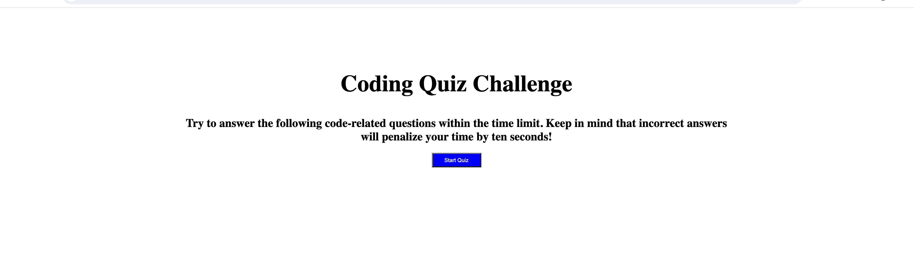

# Timed Coding Quiz

## Introduction
Welcome to the Timed Coding Quiz! Developed by Mark Barrie, this interactive web application offers a fun and challenging way for coding boot camp students to test their JavaScript knowledge. The quiz is not only a great tool for learning but also for gauging progress against peers.



## User Story
```
AS A coding boot camp student
I WANT to take a timed quiz on JavaScript fundamentals that stores high scores
SO THAT I can gauge my progress compared to my peers
```

## Features
- **Start the Quiz**: Upon clicking the "Start Quiz" button, a timer begins, and the first question is presented.
- **Answer Questions**: Each question needs to be answered before moving to the next. 
- **Time Penalty for Incorrect Answers**: For every incorrect answer, time is subtracted from the clock.
- **Game Over Conditions**: The quiz ends when all questions are answered or when the timer reaches zero.
- **Save High Scores**: At the end of the game, you can save your initials along with your score.


## Gameplay
1. **Starting the Quiz**: When you click the "Start Quiz" button, the timer starts at 180 seconds, and you will be presented with a series of JavaScript questions.
2. **Answering Questions**: Select your answer from the given options. If correct, you move to the next question; if incorrect, 10 seconds are deducted from the timer.
3. **End of Quiz**: When you have answered all questions or the timer runs out, the game ends.


4. **Saving Your Score**: Enter your initials to save your score. You can then view your score alongside other participants, fostering a competitive learning environment.


## Development
The Timed Coding Quiz is built using HTML, CSS, and JavaScript. The JavaScript logic handles the quiz functionality, including the timer, question navigation, score calculation, and local storage for high scores.

## Deployment
Experience the Timed Coding Quiz now: [Timed Coding Quiz App](https://mbarrie1979.github.io/Timed_Coding_Quiz/)

## Credits
Developed by: Mark Barrie

---

### Developer Notes
- This README includes screenshots located in the `assets/readme` folder for a visual guide through the app.
- The quiz app's code is structured to provide a seamless and interactive user experience, with careful attention to timing functions and DOM manipulation.
- As a developer, I focused on creating a user-friendly interface while ensuring the quiz logic is efficient and reliable.

---

For more information or to view other projects, please visit my [GitHub profile](https://github.com/mbarrie1979).
